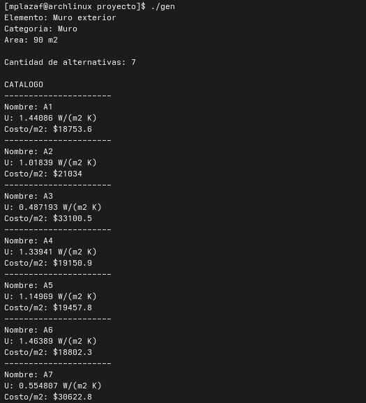
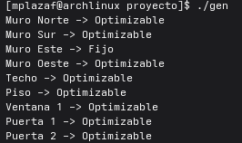

# Proyecto Optimización (INF-292)
## Clases

### Alternativa
### Elemento
### Instancia

## Funciones
A continuación se explica en palabras sencillas qué hace cada función

### generarDimensiones()
Tipo: void (modifica referencias)

Escoge un valor aleatorio para el largo, ancho y altura de una instancia dentro de un rango de valores sacado del ministerio de vivienda y otros asumidos.
### generarUmax()
Retorna: un número
Genera un valor Umax para la vivienda dentro de el rango.
### elegirCategorias()
Retorna: arreglo de categorias (strings)
Si la instancia es pequeña, elige al azar 3 o 4 categorias.
Si la instancia es mediana o grande tiene que devolver todas.
### generarCantidadAlternativas()
Retorna: numero
Dependiendo del tamaño de la instancia, retorna un valor dentro del rango de cantidad de alternativas que dice la pauta.
### generarU()
retorna: Número
Dependiendo del tipo de elemento, retorna un U dentro de un rango asociado a cada tipo.
### generarCosto()
Retorna: numero
Se le entrega un elemento y una categoria y un U. Dependiendo de eso, genera el costo de tal forma que si el U va bajando, el precio va aumentando!
### generarCatalogo()
Retorna : void (modifica a elemento )
Modifica a elemento, agregandole alternativas a su arreglo de alternativas.
### generarElementoFijo
Retorna: void (modifica referencia de elemento)
Como no hay nada que elegir, no tiene alternativas, pero genera un U y un precio y los deja en los atributos Ufijo y costoFijoM2.
### generarELementoOptimizable()
retorna: void (modifica referencia)
Toma un elemento y le genera un catálogo con la función generarCatalogo. Nada más.
###
## Consideraciones lógicas
### Área muros - ventanas - puertas
Se reparte el área de aberturas en los muros entre los 4 muros, es decir no se toma en cuenta la geometría por motivos prácticos.
areaAberturasPorMuro = (areaVentanasTotal + areaPuertasTotal)/ cantidadMuros;

## Cómo ejecutar
1. Descargue todos los archivos y póngalos en la misma carpeta. Abra una terminal en esa carpeta.
2. escriba "make", entonces se habrá generado un ejecutable llamado "gen"
3. escriba "./gen"
4. Para borrar el ejecutable, escriba "make clear".

## Generacion de catalogo de alternativas

## Generacion de elementos

